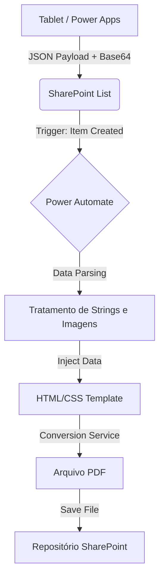
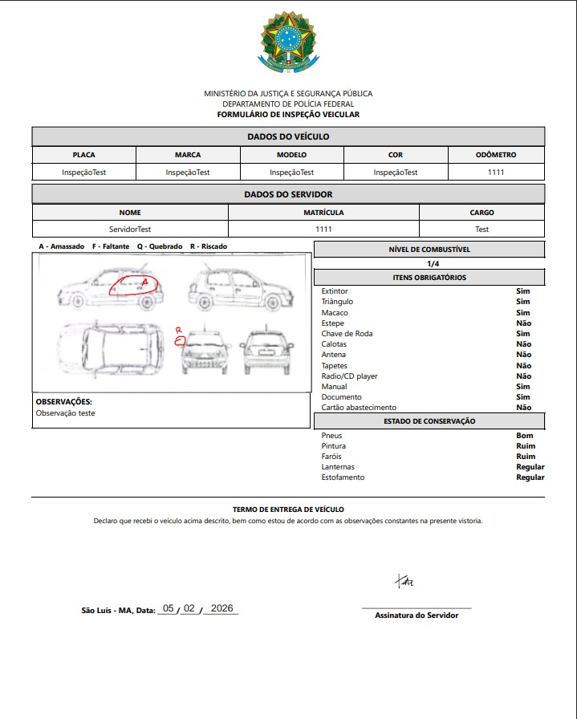

# Sistema de Vistoria Veicular Digital (Federal Police Internship)

> **Nota:** Este é um projeto desenvolvido para uso interno real. 

##  Sobre o Projeto
Sistema desenvolvido para modernizar o processo de cautela e vistoria de viaturas. A solução substituiu formulários em papel por um fluxo 100% digital, garantindo integridade dos dados e rastreabilidade histórica da frota.

##  Arquitetura da Solução
A solução utiliza uma arquitetura *Event-Driven* baseada na Microsoft Power Platform:



* **Frontend:** Power Apps (Canvas) para interface móvel.
* **Automação:** Power Automate para regras de negócio e processamento assíncrono.
* **Database:** SharePoint Lists como repositório de dados estruturados.
* **Geração de Documento** Conversão dinâmica de HTML/CSS para PDF.

##  Destaques de Implementação 

Este projeto exigiu soluções de engenharia para superar limitações nativas da plataforma:

### 1. Manipulação de Imagens e Canvas (Overlay)
Um dos maiores desafios foi capturar o desenho das avarias feito sobre a planta do carro e renderizá-lo corretamente no relatório final.
* **Solução:** O app converte o input da caneta em uma string **Base64**. No backend, essa string é tratada (JSON Parsing) e injetada em uma tag `` no HTML.
* **CSS Tuning:** Foi necessário um ajuste manual de CSS (`z-index`, `positioning absolute`) para garantir que as marcações de avaria (X, Riscos) ficassem na posição exata sobre a imagem do veículo na conversão para PDF, sem sofrer cortes ou deslocamentos.

### 2. Validação de Dados Condicional
Para garantir a consistência do banco de dados ("Dirty Data Prevention"), implementei regras de validação no frontend.
* O botão de envio permanece desabilitado (`DisplayMode.Disabled`) até que todas as condições lógicas (campos obrigatórios, assinaturas válidas) sejam atendidas.
* [Ver lógica de validação](logic/validation_rules.fx)

### 3. Payload JSON Estruturado
A comunicação entre o App e o fluxo de automação trafega um objeto JSON complexo, contendo tipos primitivos, arrays de seleção e objetos aninhados (Choice columns).
* [Ver exemplo de Payload](logic/automate-payload.json)


##  Estrutura do Repositório

Este repositório contém a documentação técnica e extração da lógica de negócios utilizada no projeto Low-Code.

```text
/
├── assets/              # Screenshots e diagramas do sistema
├── docs/                # Documentação técnica (Modelagem de Dados e Fluxos)
├── logic/               # Extração de fórmulas PowerFx e JSON Schemas
└── README.md            # Visão geral do projeto
```

##  Tecnologias Utilizadas
* **Linguagem:** Power Fx (Lógica funcional fortemente tipada).
* **Integração:** REST APIs e Conectores OData.
* **Formatos de Dados:** JSON, Base64, HTML5/CSS3.
* **Infraestrutura:** SharePoint & Microsoft 365 Tenant.

##  Screenshots
| Interface do Tablet | Relatório PDF Gerado | Fluxo de Automação |
|:---:|:---:|:---:|
|  |  |  |

---
**Autor:** Geovanna Lima
* [LinkedIn](https://www.linkedin.com/in/geovanna-lima0308)
* [GitHub](https://github.com/GeovannaMLima)